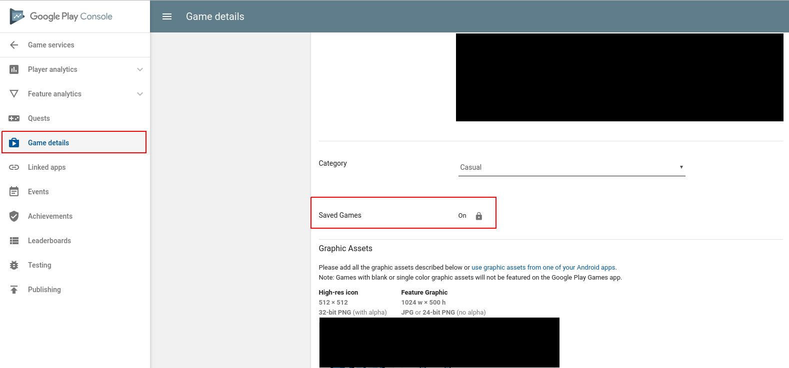

# play_games

Use Google Play Games Services on your Flutter app; this allows for signin and achievements so far, but more additions are very welcome. If you like it, give us a star and feel free to help and contribute.

## Part 1: Sign In

Call the sign in method to sign in; you must check if the login was successufully.

```dart
    SigninResult result = await PlayGames.signIn();
    if (result.success) {
        await PlayGames.setPopupOptions();
        this.account = result.account;
    } else {
        this.error = result.message;
    }
    this.loading = false;
```

But don't think it will be that easy! Actually, GPGS signin is quite a hassle to do, but [this](doc/signin.md) tutorial should help you out with this nefarious task.

Reasons for failure will be specified in the error property. Otherwhise, you can access the account property to get the account.

## Part 2: Achievements

You can both award achievements (unlock/increment) and show the Achievements screen in your game.

In order to unlock or increment an achievement, use the provided APIs:

```dart
  PlayGames.unlockAchievementByName(name);
```

This is async and you wait for the return if desired. The name is the name in your `games-ids.xml` file, you can also call the by id method.

Also, there is a method to display a popup with your achievements:

```dart
    PlayGames.showAchievements();
```

Again, this is async and returns only when the player closes the popup. So maybe you want to pause your game until that happens.

## Part 3: Saved Games

Firstly, you must enable Saved Games. Go to your Google Play Console > Game Services > Select your game > Game details and toggle Saved Games option on. Then Save and publish. Beware, this cannot be later turned off.



Secondly, in order to use the Saved Games feature, you must required explicit permission upon logging in. Thankfully, the `signIn` method can be configured to ask for that permission via the `scopeSnapshot` option, like so:

```dart
    SigninResult result = await PlayGames.signIn(scopeSnapshot: true); // allow to load/save games later
```

By default that option is false, so be sure to check it in. In Saved Games, a `snapshot` is of one save slot, that is, one representation of the game state that can be reloaded later. It is comprised of `content`, a blob, and `metadata`, a structured key-value pairs set.

You can use the methods `openSnapshot` and `saveSnaphost` to load and save game data under a given `snapshotName`. If your game has several slots, use several differente names for then. Otherwise, use only a single `snapshotName` for everything. A few points to ponder:

 * You put your save data in the `content` field, which is a String. You can put anything there (json, custom format, etc).
 * Metadata are also retrieved but for now only the description can be set. These metadata are useful if you are using the default save game screen provided (not support by this lib). Otherwise you can get some information from it.
 * Whenever you save a snapshot, if you intend to save again, you must reopen. You can either keep it open util the player saves the game, then save and reopen, or keep it closed, when the player saves, you open and save. Whenever you save, it is closed.

Here follows an example of the usage of the APIs from the [crystap](https://github.com/luanpotter/crystap) sample open-source game used to showcase this plugin:

```dart
    Future<int> fetchStartAmount() async {
        Snapshot save = await PlayGames.openSnapshot('crystap.main'); // load the existing save or create a new empty one if none exists
        if (save.content == null || save.content.trim().isEmpty) {
            return 0; // default value when there is no save
        }
        return int.parse(save.content);
    }

    Future<bool> saveAmount(int amount) async {
        bool result = await PlayGames.saveSnapshot('crystap.main', amount.toString()); // save the current state to the snapshot
        await PlayGames.openSnapshot('crystap.main'); // reopen snapshot after save
        return result;
    }
```

Here our data is just a single integer, that we convert to a String in order to save it within the content. Again, your save can be an arbitrarily complex JSON or anything like that. See the full Crystap game for more in-depth details on how to use the API.

There are also APIs for conflict resolution. If you want more robuts integration, check those out in the source code.

## Part 4: Leaderboards

To use Leaderboards, you must create one in the GPGS console. Also, you can regenerate your games-ids files to be able to use the leaderboard name instead of id.

Once that's done, you can use the following APIs that are available:

```dart
  static Future<SubmitScoreResults> submitScoreByName(String leaderboardName, int score) async;
  static Future<SubmitScoreResults> submitScoreById(String leaderboardId, int score) async;
  static Future<ScoreResults> loadPlayerCenteredScoresByName(String leaderboardName, TimeSpan timeSpan, CollectionType collectionType, int maxResults, { bool forceReload = false }) async;
  static Future<ScoreResults> loadPlayerCenteredScoresById(String leaderboardId, TimeSpan timeSpan, CollectionType collectionType, int maxResults, { bool forceReload = false }) async;
```

These methods are pretty thin wrappers over the Java/Android APIs, so you can check details about that the official docs. Also, checkout the crystap game for more details on how to implement this feature (better docs are on the way!).
