# Configuration required for GPGS Sign In

## Concepts: Don't mix the consoles!

Firstly, as stated already, GPGS stands for Google Play Games Services.

Google has three major consoles: Play Console, Cloud Console and Firebase Console.
 * [Google Play Console](https://play.google.com/apps/publish/) is related to publishing games on the Play Store and using the GPGS.
 * [Google Cloud Console](https://console.cloud.google.com) is the regular console for anything Google Cloud related (GAE, GCE, IAM, etc, etc).
 * [Firebase Console](https://console.firebase.google.com) is the console for Firebase related stuff, that are slowly being intertwined with GCP stuff.

 Don't get those mixed up!

## Create a GPGS project

Let's assume you already have your Application registered in Google Play Console; that is what allows you to have a Store listing, and publish your app. If you don't, you should be able to easily create one without problems.

That being set up, you need to create the Games Services project. That is a different thing! Access the [GPC](https://play.google.com/apps/publish), login if not already, and select *Game Services* on the left menu:

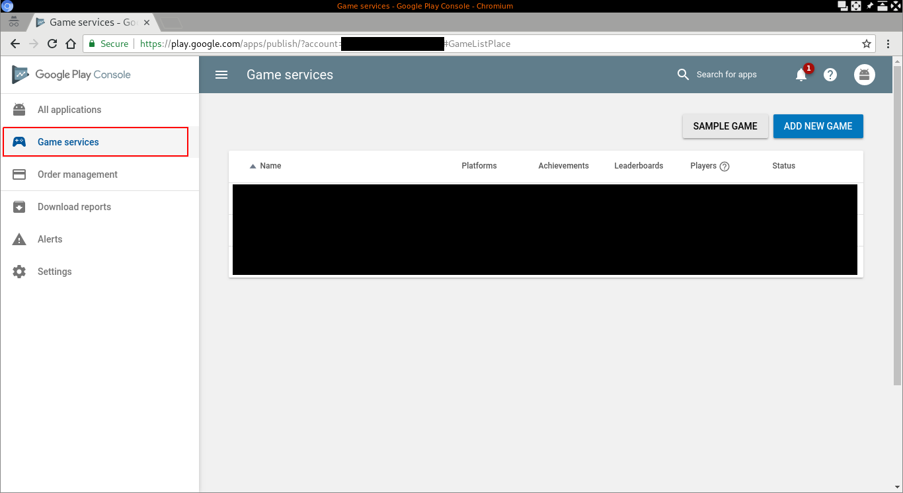

You might need to accept some lots of terms and conditions.

Now you need to create a new game; if this is your first time, you will need to click on the blue button *SET UP GOOGLE PLAY GAMES SERVICES* in the center of the screen.

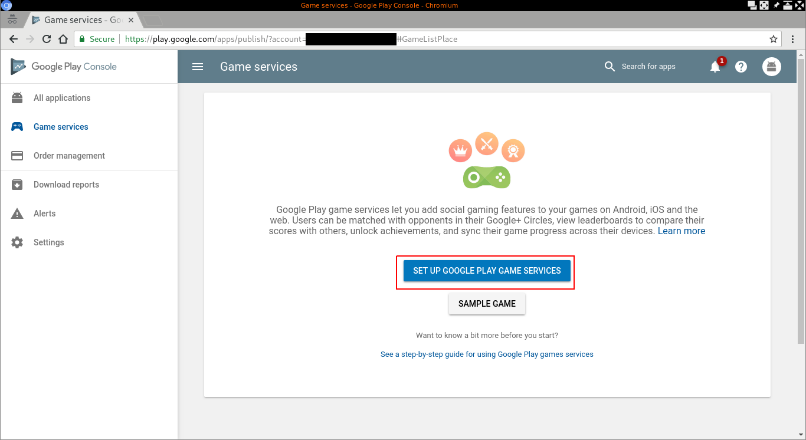

Otherwise, click on the *ADD NEW GAME* blue button on the top right corner:

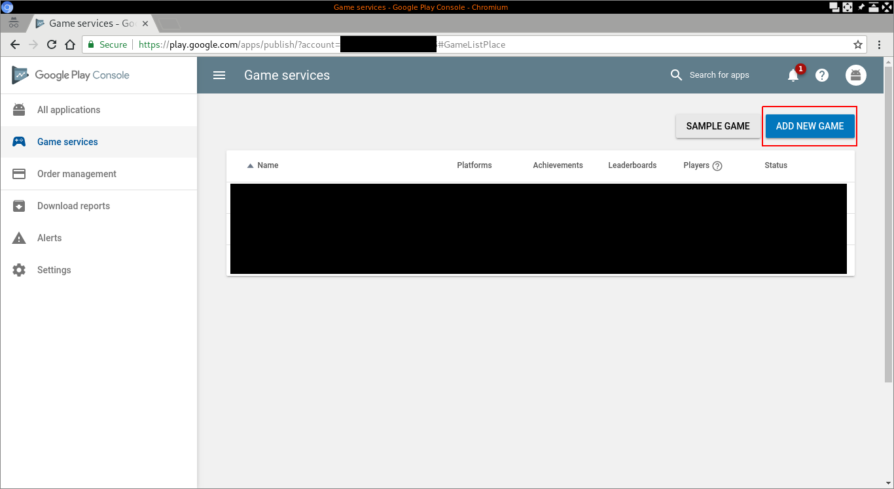

Either way, you will the the following dialog:

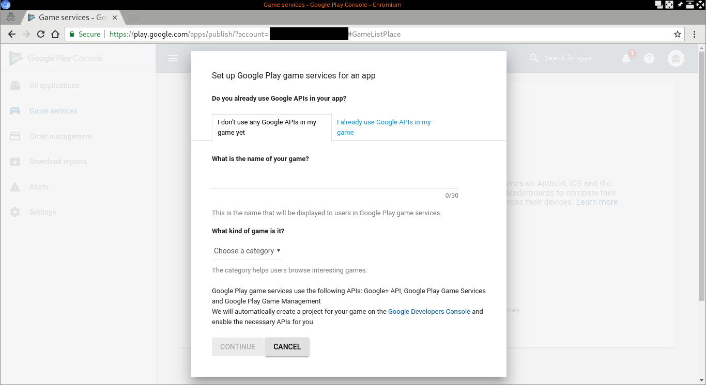

Fill both the name of the game and the category (you can copy from the Application you already have under *All applications*), and tap *CONTINUE*.

You will be taken to your game page. A few things need to be done here. In order to publish (you can test without Publishing), you need to fill the Game Details page (basically just copying details that you already filled on your Application). You will find out that an orange check in the menu means it's ok for testing, and a green one means it's ok to publish. You can refrain from filling these for now, as long as you follow the Testing procedures in the end. Otherwise, I'd recommend you already fill this so you won't forget anything later on.

## Link your App

This is the most unfriendly and cryptic part, so pay attention!

Firstly, you will need to get ahold of a couple things: your **package name** and **SHA-1 fingerprints**.

### Package Name

You porbably know your **package name** already, because you selected in the past. If you don't, the easiest place to find it is on your *AndroidManifest.xml* (android/app/src/main/AndroidManifest.xml), on the first line, on the <manifest> tag, package property.

However, there is a catch. This package name must be match in several places, otherwise, you will get errors. Make sure these four places match the same package name:

 * The folder structure (android/app/src/main/java/your/package/name);
 * The actual java files (`package your.package.name`);
 * Your AndroidManifest (android/app/src/main/AndroidManifest.xml), in the `manifest` tag, the `package` property; something like:

```xml
<manifest xmlns:android="http://schemas.android.com/apk/res/android" package="your.package.name">
```

 * Your app module gradle.build file (android/app/build.gradle), in android > defaultConfig > applicationId), something like:

```groovy
android {
    compileSdkVersion 27

    lintOptions {
        disable 'InvalidPackage'
    }

    defaultConfig {
        applicationId "your.package.name"
        ...
    }
}
```

Of course your actual Java packages might be subpackages of your **package name**, but they must start with the value on Android Manifest/applicationId. This base value is also the one you want to get ahold of for the purposes of this tutorial.

As per Java convention, you should always select a package name that represent a domain that your own (but reversed); e.g., com.yorudomain.subdomain.anything.

One very important thing to note here is:

> Note: Both the **com.example** and **com.android** namespaces are **forbidden** by Google Play.

From [here](https://developer.android.com/guide/topics/manifest/manifest-element#package), emphasis mine.

These might be the default names from your setup, but they will not work with any Google services and give cryptic errors, so make sure to change that.

### SHA-1 Fingerprint

Every APK is signed with a keystore. If you never set it up, it might use a generic keystore configured for your system, and that is far from ideal, because everyone in your team will need to use the same keystore for this project (otherwise signin won't work). So, you should use a unique keystore for each application. You can also use two per app, one for debug and the other for release (that's very common).

If you already have your keystores setup, you can skip to Find out SHA-1 Fingerprint. Otherwise, use the following to generate a new one.

#### Generate a new keystore

To generate a new keystore, you must use the `keytool` command, that comes with Java. If you java bin folder is on your path, you already have this, otherwise you will need to look it up (in $JAVA_HOME/bin/keytool). Then, run:

```bash
    keytool -genkey -v -keystore my-release-key.keystore -alias alias_name -keyalg RSA -keysize 2048 -validity 10000
```

Put a password of your choosing. This is a not a personal password of yours, it's just to encrypt this file, that you might share with other people on the project. So just generate a random one and keep it in a secure place for safekeeping.

Then you need to fill a lot of information. Normally I fill only my name (first name) and leave everything else UNKNOWN. Notice that in the end you must explicitly write [yes] to accept everything. Nothing of this is used anywhere.

For the second password, just press enter to use the same as before (you could have two, but that'd be too much, I guess).

After generating the key, you must setup your build.gradle file to use the key to sign your app. You will need to put the SHA1 you generated in the Play Console for configuration, and only an app signed with this key will work. Even in debug mode. Therefore, add the following for your app module build.gradle file (app/build.gradle):

```groovy
    signingConfigs {
        debug {
            storeFile file("/home/luan/projects/play-auth/secret/test.keystore")
            storePassword 'password'
            keyAlias 'alias'
            keyPassword 'password'
        }
    }
    buildTypes {
        debug {
            signingConfig signingConfigs.debug
        }
    }
```

Be sure to put the path to your key (better if it's a relative path, but never commit the key itself to a public repo), the passwords you selected, and the key alias (must be the same).

This will add the key just for debugging; for release, add another build type named release (you probably already have one, so just add the signingConfig property. You can use the same key, but it's ideal to have two (so that you can share the debug with everyone in your team and keep the release one very well secured).

One other (better, IMHO) option is to add a properties file, because the password and file should not be commited to your public repo. One convention I suggest is to create a `keys` folder inside `android` folder, put inside the the `key.jks` and a `key.properties` file, and add the whole folder to gitignore. You need to find another way to distribute it. The properties file has the following structure:

```
storePassword=password
keyPassword=password
keyAlias=alias
storeFile=../keys/key.jks
```

Just replace your date and your key file name (but keep the relative path like that).

Then, in your build.gradle file, for all your projects you can have the exact same setup; something like so:

```groovy
def keystorePropertiesFile = rootProject.file("keys/key.properties")
def keystoreProperties = new Properties()
keystoreProperties.load(new FileInputStream(keystorePropertiesFile))

// ...

android {

    // ....

    signingConfigs {
        release {
            keyAlias keystoreProperties['keyAlias']
            keyPassword keystoreProperties['keyPassword']
            storeFile file(keystoreProperties['storeFile'])
            storePassword keystoreProperties['storePassword']
        }
    }

    buildTypes {
        debug {
            signingConfig signingConfigs.release
        }

        release {
            signingConfig signingConfigs.release
        }
    }
}
```

Once configured, the APP will be signed with your key. You must sign it with a known keystore both for debug and testing and for production, but you can use different keys. Either way, continue to the next step to get the SHA-1 from your key.

#### Find out SHA-1 Fingerprint

Finally, once you found out what is your key (or keys), you need to get their SHA-1 signature fingerprint, wich is going to be used in the following sections. Only apps signed with one of the keys you provided will be allowed to access GPGS features, even in test mode!

In order to find out the fingerprint, you can use the `keytool` command again, like so:

```bash
    keytool -list -v -keystore test.keystore -alias test -storepass pass -keypass pass 2> /dev/null | grep "SHA1:" | rex '\s*SHA1: (.*)' '$1'
```

Here I'm using [rex](https://github.com/luanpotter/rex) to extract the infromation, but you can do that manually analyzing the response from keytool (it's very simple).

You can also check the SHA-1 from your APK, in order to make sure your build process is correctly using the desired certificate to sign it, using the keytool command:

```bash
    keytool -list -printcert -jarfile app.apk
```

Another option is to extract the APK (it's just a ZIP file) and check the `/META-INF/ANDROID_.RSA` file.

Either way, write down your SHA-1 fingerprint (or fingerprints, if you are using two keys).

#### Play Store SHA-1

There is a final catch. Apart from the fingerprint from your key(s), there is another one. Unless you disabled it, the Play Store, when you publih your app, will sign it again over your signature with its own key. That key's SHA-1 must also be added, otherwise players who download the app via store won't be able to signin. And you might not even notice this problem, because when you install the release apk you generated by hand it won't happen. So that's a final test you might make to make sure everything is working.

In order to find out this SHA-1, go back to **All applications** and select your app (this is now the regular App page, not the GPGS!):

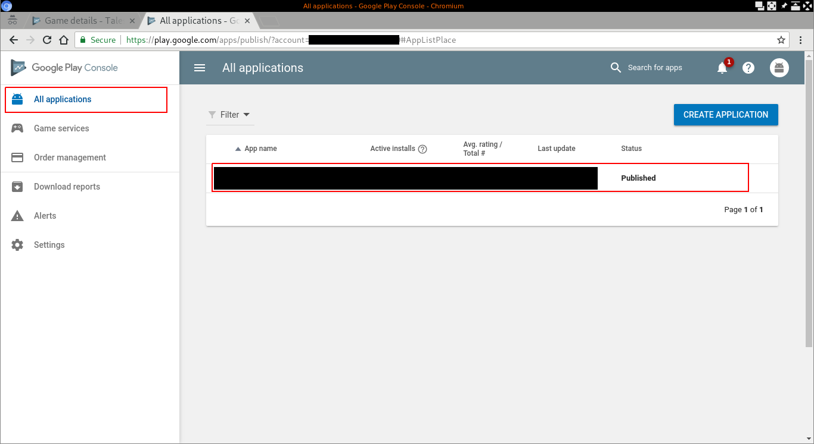

After selection your app, on the left menu, go to Release management > App signing, like so:

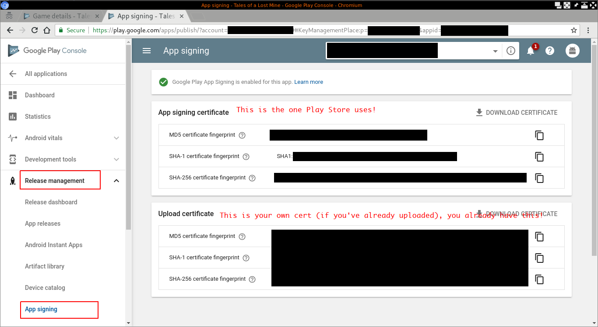

Here, if you haven't disabled it (in which case this is not necessary), you can see under 'App signing certificate' the SHA-1 certificate. Just copy that and put it up together with the other(s).

### Linking

Finally you are ready to link the app. Grab your **package name** and up to 3 **SHA-1's** and go back to GPGS panel. Select 'Linked apps' from the menu:

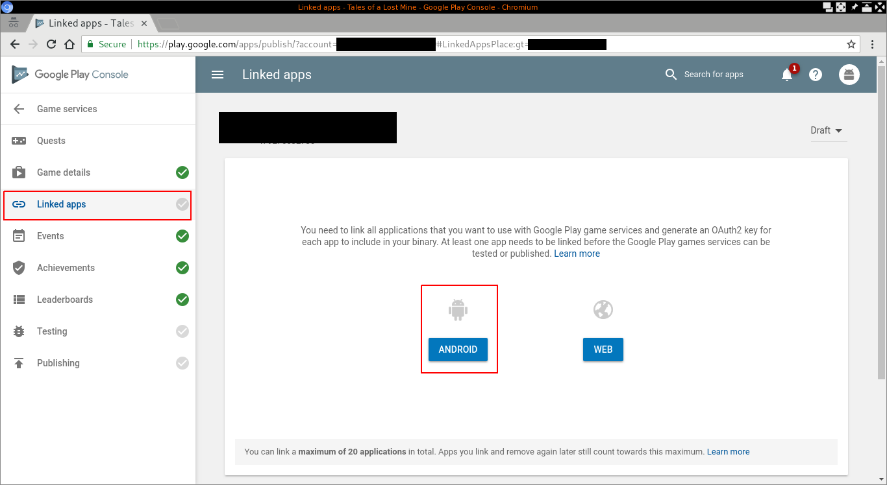

Then, click on the 'Android' blue button. In the next screen you will need to fill your package name. If you already uploaded an app to your Application on the Applications sections, it will be suggested for you. The title will be already pre-filled with what you provided earlier in the Game details, but each linked app can have a different name if you'd like. You aslo have to anwswer a few questions about your game, basically it gives you the option to turn on some special features if you so desire. I'm not going to be using any of those, so I just click 'Save and continue'.

On the next screen you will need to click 'Authorize your app now' big blue button, like so:

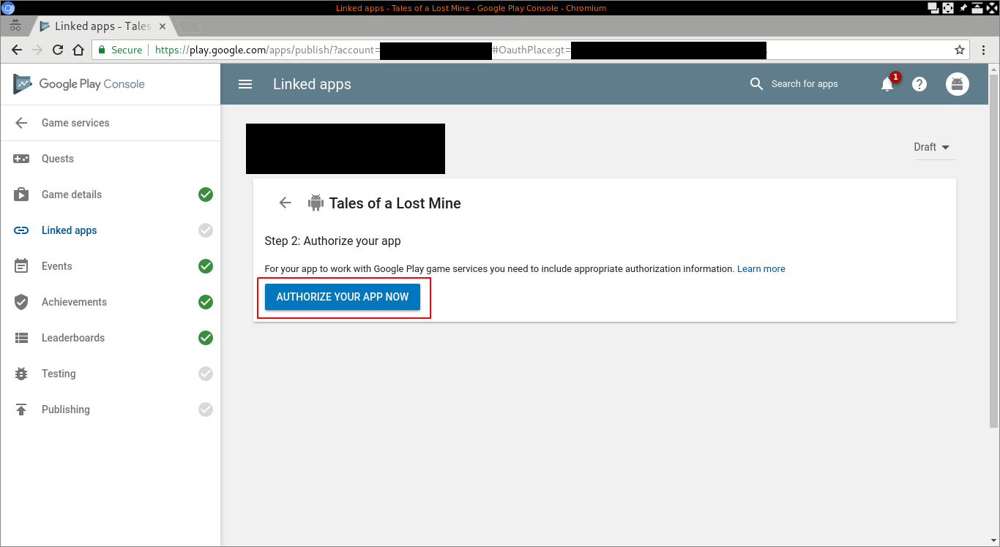

Click it and you may confirm your package name, and you will need to fill your SHA-1. **Add one of your SHA-1**, we will be able to add the other ones later. You might want to select the debug or debug/release one, if want to test it right away. But we will be able to add the other ones via the Firebase console (yeah, not here). Don't worry. Again, if you already uploaded a version of your app, it will pre-fill with the Play Store SHA-1. Beware, if you leave only that, you will only be able to test your app installing from the store (far from ideal). But we will add all te keys shortly.

After that, you will see the following:

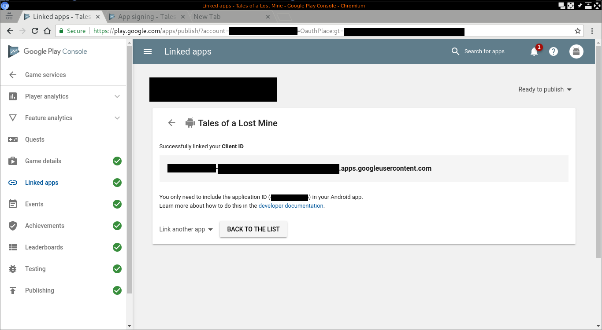

As stated, you won't need Client ID ever again. You might want to write it down just for safekeeping (for instance, you can use to make absolute sure you are adding the other SHA-1 later on to the right place, but it's not really necessary).

The Application ID, however, will be used. But we will get to that later. Actually, both can be seen later in this screen.

Now, the shady part. In order for it to work, you also need to create a Web application. No, you are not going to use it. But you need to create it. So follow the procedure again, 'Link another app' and now select Web:

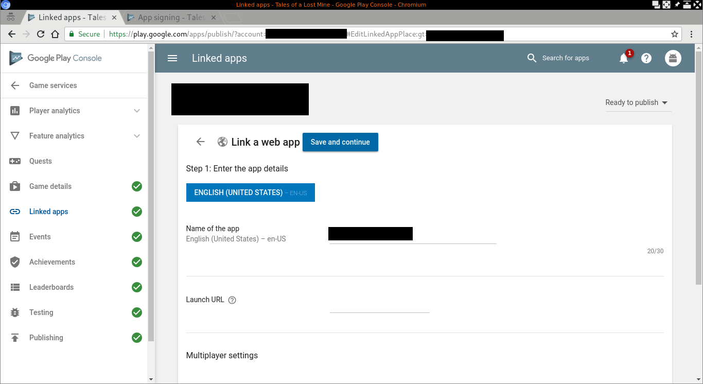

Just add a dummy url, because it's required, but won't matter. Again, 'Save and continue' and then 'Authorize'. This time, for a webapp, there are no SHA-1 fingerprints to add, so just hit Confirm.

You will be shown, again, the same client id and a new 'OAuth2 Client ID'. Note these two, they will be required. Also, there is matching pasword for your oauth client id, but to see it, you must follow the link to the Google Cloud Console. Do so and note your password. You might need to accept some more terms to access the new console (if this is your first time).

On Google Cloud Console > APIs > Credentials, where you will be taken, you can see a list of Oauth clients. You need to select the one matching the one you created by client id (you noted the client id from the web client before):

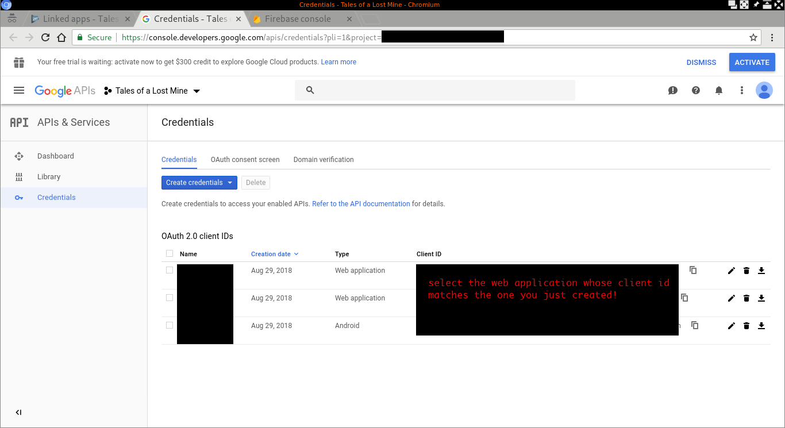

Find the match and click on the pencil to edit, where you will be able to see the client secret. Take a note of that!

Now your apps are linked, but will need to finish off on the last console you haven't use yet: Firebase.

## Firebase Console

Finally, there is Firebase configuration. On the Game Details section, there is a huge button to allow for Firebase Analytics. That is absolutely not necessary and you don't need to do it, unless you want to enable analytics via firebase (it's pretty cool).

But otherwise, just go to the [Firebase Console](https://console.firebase.google.com). If you already created a project linked with this Game before, it will appear here and you shall select it. Otherwise, you need to create a new Firebase project linked with your Games Services. Click the big blue 'Add project' button:

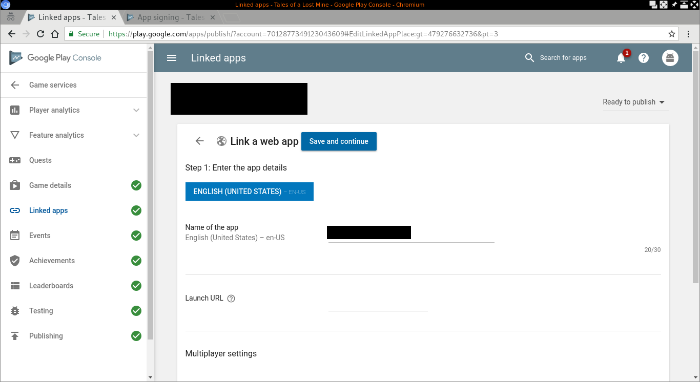

On the following dialog, you need to select on Project name your Google Cloud existing project (it exists because it was created automatically when you created your Games Services). So select that, make sure you click the option in the dropdown and don't just create a new one! Again accept the terms and click on 'Add firebase':

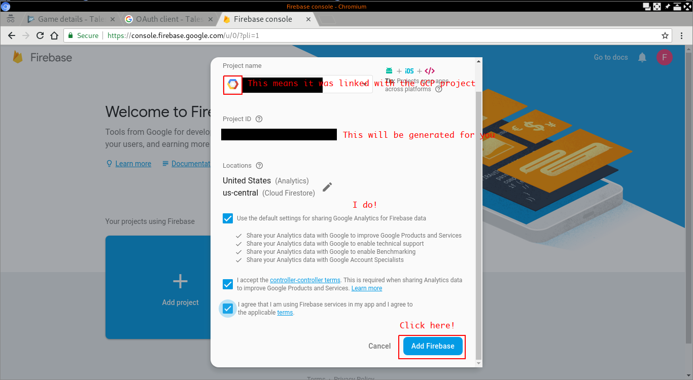

Wait for completion you will be taken to your brand new Firebase console! Here you need to do two things:

### Add your other SHA-1 keys

To do this, you need to access the little gear near Project Overview on the left menu (Settings, I guess), and then Project Settings, like so:

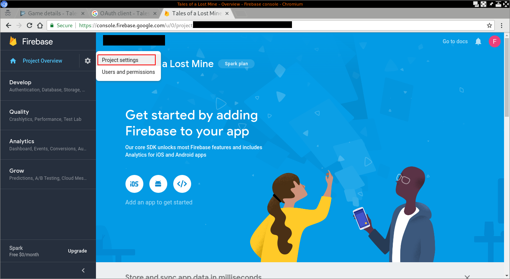

From there select the General tab (should be already) and under Your apps, add a new Android app.

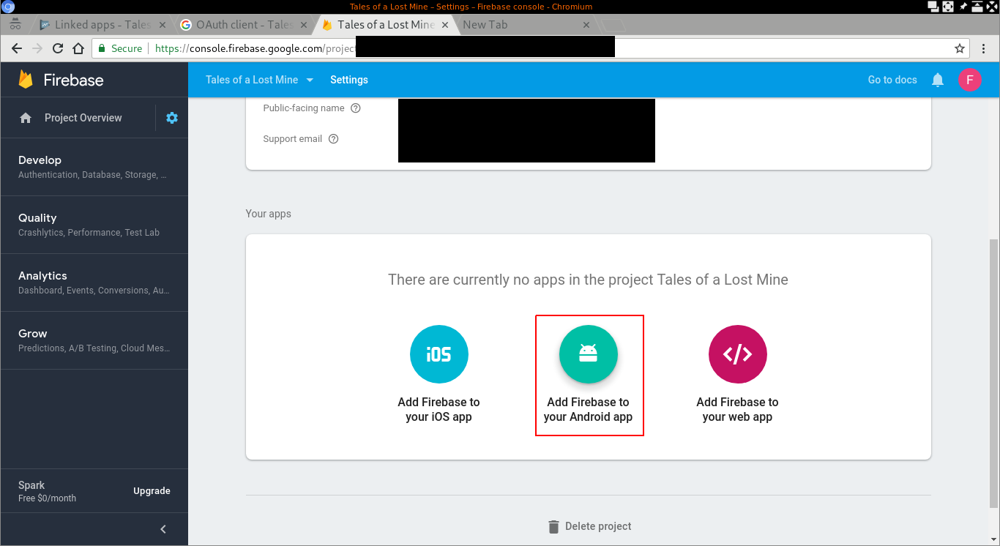

Fill again your package name, add your App nickname (basically your app's name) and, again, your debug key (or one of the keys you have). It can be the same one, soon we will add the other(s).

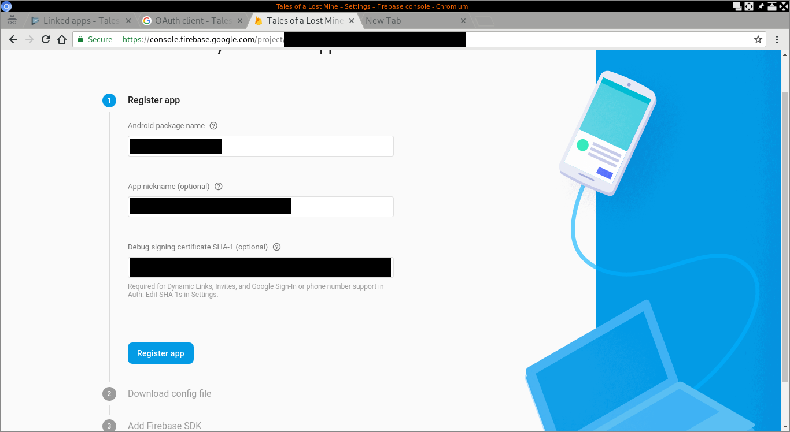

Then, click 'Register app', and continue to the next step.

Here you can download the 'google-services.json' file, but you don't need to do it know, as we will download the updated one later. Either way, you can do so if you desire, click 'Download google-services.json'.

This section tells you exactly where to put it: `android/app/google-services.json`. But we will get to that very soon.

Then, click 'Next', and you will see instructions on adding the Firebase SDK. You can skip this now, as it will be covered in the next section.

So, click 'Next' again. Finally, you can 'Skip this step' the last step. We are not ready to test yet.

Now you can finally add the other SHA! Taken again to General Settings tab, you can see the Fingerprint you just added in the screen bellow, and a button to add new Fingerprints!

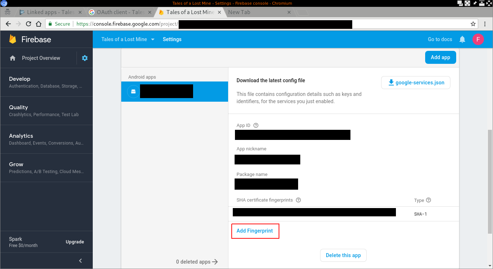

Click 'Add Fingerprint' and add the other(s) fingerprint you have. Don't forget to add the Play Store fingerprint, or the app deployed on the Store won't work!

After that, download the updated 'google-services.json' file via the download button. You must put this file in the `android/app` folder.

### Authentication

The second thing to do is to enable Game Play Services login via Firebase. Go to the left menu > Develop > Authentication:

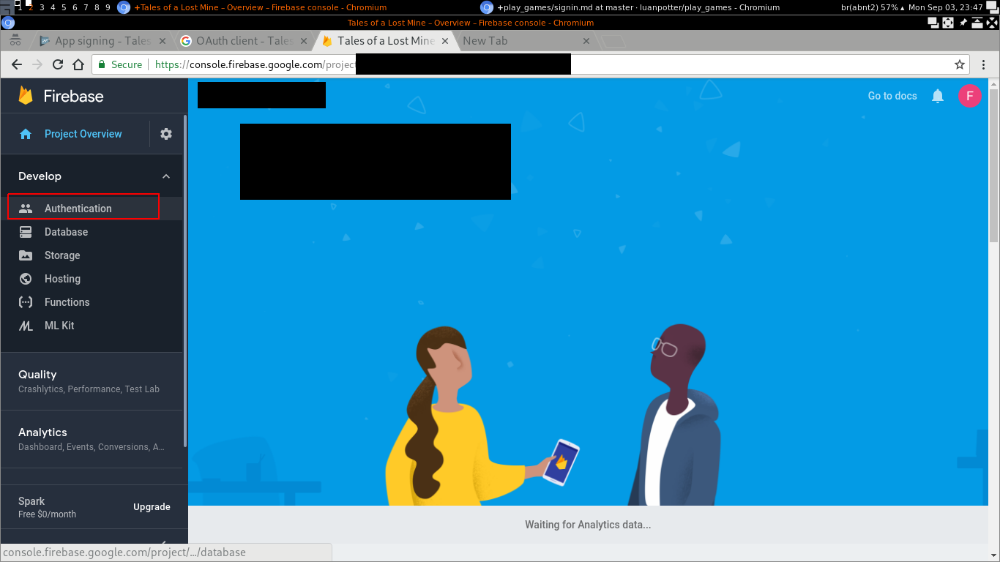

Select 'Sign-in method' tab to click 'Play Games' to enable it:

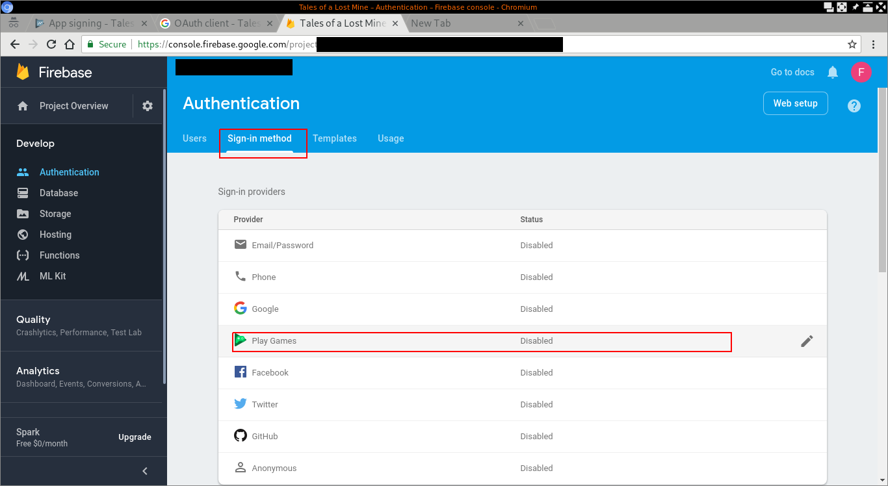

But in order to enable, you need to fill the Web Client Id and Client Secret you took note before. But the Web client, not the Android one!

Hit 'Save' and you are all set for Firebase!

Now let's go back to Google Play Console.

## Final Steps on Google Play Console

Back to the Google Play Console, the next step is to actually create an achievement. This is crucial because there is one more file you need to download, the `games-ids.xml` file, and it only gets shown after you add an Achievement.

Don't worry, if you don't publish your achievement, you can easily delete it later.

Select Achievements on the left menu and then click the big blue button 'Add achivement'.

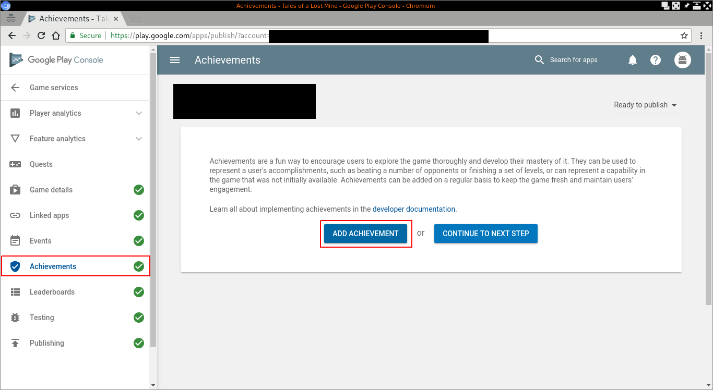

You just need to fill in the name for the purposes of this tutorial. Hit 'Save' and all done!

Now a 'Get resources' link will appear:

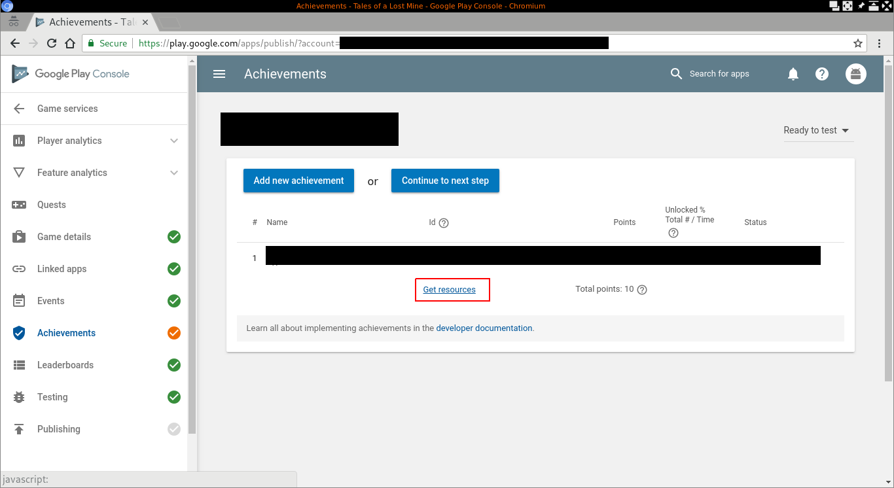

On the popup, select the XML under Android tab. Create a file with that content called `games-ids.xml` file, in the following path:

```
  android/app/src/main/res/values/games-ids.xml
```

This and `google-services.json` are the two files you need to add, but there are more stuff you need to change in your project.

For now, however, let's finish off with Google Play Console.

If you want to deploy your app to the store, you need to deploy the Game Services as well. In order to do that, nothing can be orange (all greens) on the left menu. This means you either have to fill all details for the achievements or delete the one you added (you just used it to get the `games-ids.xml` file).

Otherwise, if you just want to test, you can, but you need to add yourself as a Tester. The e-mail from your google account for the Google Cloud Console, that's already added. It's good practice to check, thouhg, under left menu > Testing. Make sure your Android device's email is added to this section.

## Configure your project

Finally we are done configuration related to the web consoles. Yay! Now just a few more steps regards configuring your project source code.

For these steps, you can see our example game [Crystap](https://github.com/luanpotter/crystap) if you have any questions.

Firstly, add `play_games` to your `pubspec.yaml` file:

```yaml
dependencies:
  flutter:
    sdk: flutter
  play_games: 0.4.2
```

And run `flutter pub get` to update. That's not enough, though! This plugin depends on Google's dependencies only as API, meaning the implementation must be provided by the application. That is done so that you can add the version you desired, as long as they are API compatible. So you need to add a couple dependencies on both your `build.gradle` files (the root and module).

On the root build file (`android/build.gralde`), you need to add `google-services` to buildscript > dependencies, in the beginning, like so:

```groovy
buildscript {
    repositories {
        google()
        jcenter()
    }

    dependencies {
        classpath 'com.android.tools.build:gradle:3.1.4'
        classpath 'com.google.gms:google-services:4.0.2' // add this line!
    }
}

// ...
```

For the module file (`android/app/build.gradle`), there are more changes necessary; you must add four dependencies and also a plugin application, in the end of your file, like so:

```groovy
// ...

dependencies {
    testImplementation 'junit:junit:4.12'
    androidTestImplementation 'com.android.support.test:runner:1.0.2'
    androidTestImplementation 'com.android.support.test.espresso:espresso-core:3.0.2'

    // add these four
    implementation 'com.google.firebase:firebase-core:16.0.3'
    implementation 'com.google.firebase:firebase-auth:16.0.3'
    implementation 'com.google.android.gms:play-services-auth:16.0.0'
    implementation 'com.google.android.gms:play-services-games:15.0.1'
}

// add this
apply plugin: 'com.google.gms.google-services'
```

Now you need to add two lines to your Android Manifest file (`android/app/src/main/AndroidManifest.xml`), inside manifest > application:

```xml
    <meta-data android:name="com.google.android.gms.games.APP_ID" android:value="@string/app_id" />
    <meta-data android:name="com.google.android.gms.version" android:value="@integer/google_play_services_version"/>
```

`google_play_services_version` comes from the dependency you added. Now the most important, `app_id`, comes from that `games-id.xml` file you setup previously, so make sure that's that.

And... Congratulations!!! You are ready to test! After all this effort! Just drop this to your dart file:

```dart
  void singIn() async {
    SigninResult result = await PlayGames.signIn();
    if (result.success) {
      await PlayGames.setPopupOptions();
      profile = Profile(result.account);
    } else {
      error = result.message;
    }
    loading = false;
  }
```

And invoke when desired.
